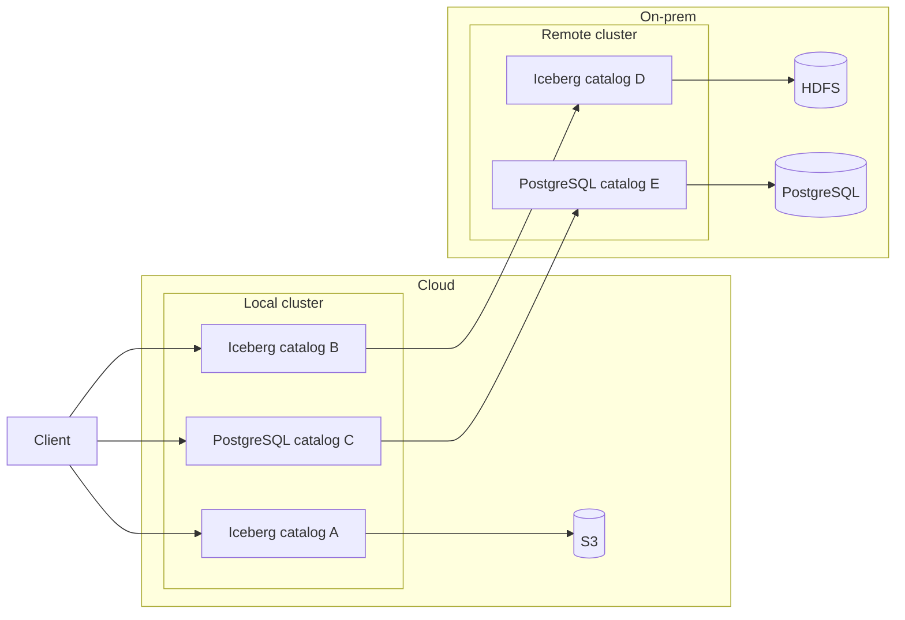
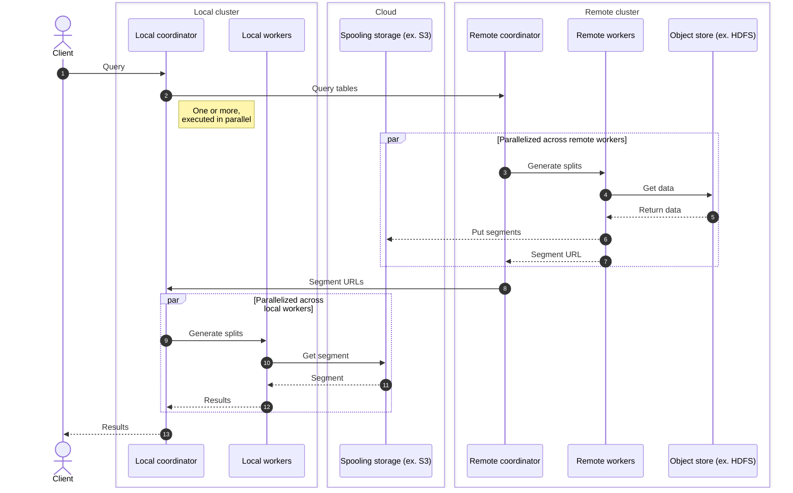

# Starburst Enterprise Stargate Parallel Connector

A parallel version of the Stargate connector, which allows executing queries on
other Starburst Enterprise, or Galaxy clusters.

Example use case, where a cluster running in AWS can query data from a different
geographical location, secured by a remote cluster.

